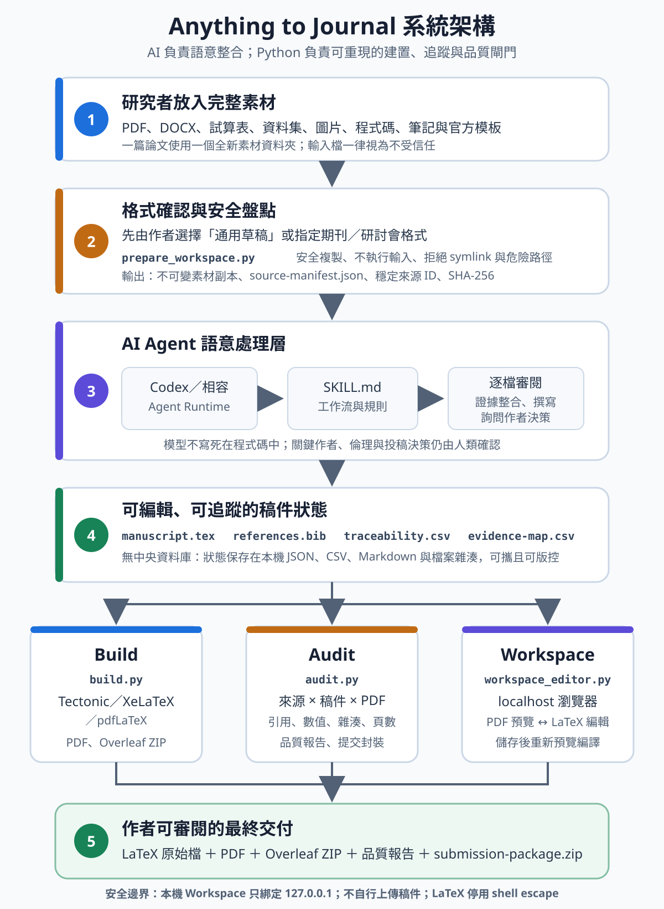

<p align="center">
  
</p>

<p align="center"><strong>Anything in. Journal out.</strong></p>

<p align="center">
  <a href="https://hackathon-t096-anything-to-journal-website.howardtuan.workers.dev/">作品展示</a> ·
  <a href="README.zh-TW.md">完整中文文件</a> ·
  <a href="README.en.md">English</a>
</p>

> **BUILDMODE GEN-AI HACKATHON 2026**｜隊伍編號：T096｜參賽組別：Track 02 — AI for Everyday Life（日常生活 AI）

# Anything to Journal

## 問題與目標

研究者的論文素材經常散落在 PDF、Word、試算表、圖片、程式碼與筆記中。人工整併不只耗時，也容易讓數據、引用、圖表與原始證據失去連結；直接請生成式 AI「寫成論文」又缺少逐檔盤點、來源追蹤、格式確認與品質閘門，難以審閱或重現。

Anything to Journal 是一套開源 Agent Skill。目標使用者是研究者、學生與研究團隊：把一篇論文的完整素材放進單一全新資料夾，先選擇通用草稿或指定期刊／研討會格式，再由 Agent 逐檔閱讀與整合。系統會產生可編輯 LaTeX、編譯 PDF、來源清冊、證據對照、品質報告及 Overleaf 上傳包；所有關鍵輸出仍由作者確認，工具不會代替作者投稿。本作品以 AI 改善日常研究、學習與個人生產力，因此參加 Track 02 — AI for Everyday Life（日常生活 AI）。

### 100–200 字參賽摘要

研究者的論文素材常散落在 PDF、Word、試算表、圖片與筆記中，人工整併耗時，也容易失去數據、引用與圖表的來源脈絡。Anything to Journal 將完整素材資料夾交給 AI Agent，先確認通用或指定投稿格式，再逐檔盤點、建立 SHA-256 與證據對照、產生可編輯 LaTeX 和 PDF，並透過自動稽核、本機編輯器與 Overleaf 封裝，讓研究者更快取得可追蹤、可重現且仍由本人掌控的投稿草稿。

## 核心功能

- **混合素材輸入**：接受 PDF、DOCX、Markdown、LaTeX、試算表、資料集、圖表、參考文獻匯出檔、程式碼與官方模板。
- **先決定格式、再讀內容**：在來源存取前明確選擇「通用草稿」或「指定投稿格式」，避免 Agent 默默猜測規格。
- **完整來源盤點**：為每個檔案建立穩定來源 ID、位元組數與 SHA-256；每份素材都必須標記為已使用或附上未使用原因。
- **證據可追蹤**：以 `traceability.csv` 與 `evidence-map.csv` 對應主張、數值、引用、圖、表、公式及輸出位置。
- **可編輯論文交付**：產生 LaTeX 原始檔、參考文獻、PDF、完整稽核包，以及根目錄含 `main.tex` 的 Overleaf ZIP。
- **品質閘門**：檢查未解 placeholder、缺失引用、無來源數值、來源雜湊、作者決策、頁數、編譯結果與逐頁視覺檢查紀錄。
- **本機 Manuscript Workspace**：在 `127.0.0.1` 提供 PDF 預覽及 LaTeX 編輯；儲存後重新編譯，失敗時保留上一份成功 PDF，並防止外部修改覆蓋未儲存內容。

## 系統架構

<p align="center">
  
</p>

整體流程分成五步：研究者提供完整素材；系統先確認投稿格式並建立來源雜湊；AI Agent 依 Skill 規則逐檔審閱、整合證據與撰稿；稿件以可版控的本機檔案保存；最後由 Build、Audit 與 Workspace 三條路徑共同產生作者可審閱的交付包。

### 元件與資料流

| 元件 | 職責 | 主要輸入／輸出 |
| --- | --- | --- |
| Agent Skill | 規範格式選擇、完整讀檔、證據整合、作者決策與交付流程 | `skills/anything-to-journal/SKILL.md` |
| Workspace preparation | 不執行輸入檔，安全複製並建立來源 ID、雜湊、清冊及初始專案 | 素材資料夾 → `journal-output/source/` |
| AI Agent runtime | 執行需要語意理解的逐檔審閱、引用整理與論文撰寫 | 來源清冊／素材 → LaTeX、BibTeX、追蹤表 |
| Build pipeline | 關閉 shell escape 編譯 LaTeX，建立 PDF 與扁平化 Overleaf 上傳包 | `manuscript/` → `submission/` |
| Audit pipeline | 交叉檢查來源、證據、作者決策、編譯、頁面檢查與封裝內容 | 專案狀態 → 品質報告／可提交或草稿狀態 |
| Manuscript Workspace | 只綁定 localhost；直接編輯實際 LaTeX，原子儲存並更新 PDF 預覽 | `manuscript/` ↔ 瀏覽器 |
| 專案狀態 | 不使用中央資料庫；以本機 JSON、CSV、Markdown 與檔案雜湊保存可攜、可版控的狀態 | `project.json`、來源清冊、追蹤表與報告 |

AI 模型不寫死在程式碼中，也沒有在此儲存庫內呼叫特定模型 API；語意工作由使用者啟用技能時所選的 Agent runtime 與模型執行。Python 腳本則負責可重現的盤點、雜湊、編譯、封裝、狀態失效與稽核。這個分工讓生成工作保有彈性，同時把可以確定性驗證的部分留在本機程式中。

### 隱私與安全邊界

- Manuscript Workspace 僅綁定 `127.0.0.1`，不使用 CDN，也不自行上傳稿件。
- 來源盤點拒絕 symlink、不安全路徑與非一般檔案；輸入中的巨集、程式及嵌入物件不會在 intake 階段執行。
- LaTeX 編譯停用 shell escape；編輯採原子寫入並檢查外部修改衝突。
- 研究素材是否會傳給模型，取決於使用者選擇的 Agent 平台與設定；使用者應依資料敏感度及該平台政策決定是否處理。
- 儲存庫不需要也不應包含 API Key、Token、密碼、未公開研究資料或個人資料。

## 使用技術

| 類型 | 技術／服務 | 用途 |
| --- | --- | --- |
| AI 模型 | 由使用者在 Agent runtime 選擇的模型 | 素材理解、證據整合、學術寫作與互動式決策；本專案不綁定模型名稱或權重 |
| Sponsor 技術 | OpenAI Codex、Agent Skills | 載入 `SKILL.md`、執行端到端研究助理工作流，並與本機檔案協作 |
| 核心／後端 | Python 3.10+、Python standard library | 素材盤點、DOCX OOXML 檢查、SHA-256、LaTeX build、audit、ZIP 與 localhost HTTP server |
| 前端 | 原生 HTML、CSS、JavaScript | 本機 PDF 預覽、LaTeX 編輯、搜尋、儲存、重新編譯與衝突提示 |
| 文件編譯 | Tectonic（優先）、latexmk／XeLaTeX／pdfLaTeX | 產生可檢查 PDF；編譯時不開啟 shell escape |
| 安裝／發佈 | Node.js 18+、npm／npx | 安裝與安全更新 Agent Skill |
| CI／版本控制 | GitHub Actions、GitHub | Node installer 測試、Python 語法檢查、合成 pipeline 測試與開源交付 |
| 選用外部工具 | Pandoc、Poppler、LibreOffice、Inkscape、ImageMagick、Overleaf | 高保真格式轉換、頁面渲染、原生文件檢查、影像轉換與線上 LaTeX 編輯 |

## 安裝與執行

### 方法 A：評審／使用者快速體驗（建議）

需求：Node.js 18+、Python 3.10+，以及至少一套 TeX 引擎（優先 Tectonic）。不需要設定本專案專用的 API Key。

```bash
npx anything-to-journal@latest install
```

建立一個只包含單篇論文素材的全新資料夾，使用支援 Agent Skills 的 Codex 工作環境開啟該資料夾，再輸入：

```text
$anything-to-journal 把這個資料夾裡的所有素材做成 Journal 稿件。
```

Agent 會先詢問要使用通用草稿或特定期刊／研討會格式；確認後才讀取來源並開始工作。

### 方法 B：從原始碼安裝與驗證

```bash
git clone https://github.com/howardtuan/Hackathon-T096-Anything-to-Journal.git
cd Hackathon-T096-Anything-to-Journal
npm ci
npm test
python3 -m unittest discover -s tests -v
python3 install.py --mode copy
```

Windows 若沒有 `python3` 命令，可將上列指令改為 `python`。完整測試會驗證 POSIX 路徑、可執行 fixture 與 symlink 防護，因此 Windows 原生環境建議透過 WSL 或 GitHub Actions 執行測試。`install.py` 預設不覆寫既有安裝；開發者也可省略 `--mode copy`，以 symlink 連回本儲存庫的唯一技能來源。

檢查本機完整工作流依賴：

```bash
python3 skills/anything-to-journal/scripts/doctor.py
```

### 直接準備可稽核工作區

通常由 Agent 執行。通用草稿的等效指令如下：

```bash
python3 skills/anything-to-journal/scripts/prepare_workspace.py \
  /absolute/path/my-paper-materials \
  --output /absolute/path/my-paper-materials/journal-output \
  --draft-only \
  --confirmed-by "REQUESTING USER" \
  --confirmation-note "User explicitly requested a generic journal draft."
```

指定投稿格式時，將 `--draft-only` 改為 `--target-venue`、`--venue-type`，並提供當前官方說明網址或官方模板。完整參數與流程見[中文使用文件](README.zh-TW.md#直接建立工作區)。

Agent 完成稿件、來源對照及作者決策後，執行正式編譯與稽核：

```bash
python3 skills/anything-to-journal/scripts/build.py /absolute/path/journal-output
python3 skills/anything-to-journal/scripts/audit.py /absolute/path/journal-output --require-pdf
```

啟動本機編輯介面：

```bash
python3 skills/anything-to-journal/scripts/workspace_editor.py \
  /absolute/path/journal-output
```

指令會印出 `http://127.0.0.1:PORT`。完成任何手動或 Agent 修改後，都必須重新執行正式 build、逐頁視覺檢查及 audit。

### 主要輸出

```text
journal-output/
├── source/          # 不可變素材副本、來源 manifest、清冊
├── manuscript/      # manuscript.tex、references.bib、來源與證據對照
├── reports/         # 格式決策、逐檔審閱、作者決策、視覺檢查、品質報告
├── submission/
│   ├── overleaf-upload.zip
│   ├── manuscript.pdf 或 DRAFT_NOT_FOR_SUBMISSION.pdf
│   └── submission-package.zip
└── project.json
```

## 作品展示

- 作品展示網址：[Anything-to-Journal — Anything in. Journal out.](https://hackathon-t096-anything-to-journal-website.howardtuan.workers.dev/)
- 原始碼：[GitHub — Hackathon-T096-Anything-to-Journal](https://github.com/howardtuan/Hackathon-T096-Anything-to-Journal)
- 評選影片：[T096-DEMO-Anything-to-Journal（YouTube，1:46）](https://youtu.be/fMaaxRzUqw8)

影片依序呈現：混合素材資料夾 → 格式確認 → 來源 manifest／證據追蹤 → 生成 LaTeX 與 PDF → 本機 Workspace 修改 → audit 與 Overleaf ZIP。

## 限制與未來工作

- 產出品質取決於來源完整度及所選模型；工具以追蹤與閘門降低幻覺風險，但不能保證內容正確或論文被接受。
- 指定投稿格式必須取得當前官方 author guide 或官方模板；格式規則不完整時不會自行猜測。
- 作者、倫理、同意、資金、利益衝突、資料可用性、素材權利及最終核准只能由人類作者確認。
- PDF 完成狀態需要可用 TeX 引擎與逐頁人工視覺檢查；只有 CLI 的環境仍可產生原始檔與稽核資料，但可略過本機 UI。
- 複雜 DOCX 的 SmartArt、OLE、修訂與原生圖表若要高保真還原，可能需要 Word／LibreOffice、Pandoc 或額外轉檔工具。
- 目前 Workspace 是單機、單人編輯介面；未來可加入多人審閱、更多官方模板 adapter、引用管理器整合與更完整的可及性測試。

## 第三方服務、資料與素材

### 賽前既有內容揭露

本作品以團隊先前建立的開源專案 [howardtuan/Anything-to-Journal](https://github.com/howardtuan/Anything-to-Journal) 為基礎，**不是在黑客松現場從零開始**。原始專案公開 Git 紀錄顯示初始版本建立於 **2026-08-14**，npm／工作區功能的 v1.1.0 於 **2026-08-20** 完成；本次比賽專用儲存庫建立於 **2026-09-05**，用於彙整參賽版本、說明與後續提交紀錄。

### 來源與授權摘要

| 項目 | 來源 | 使用方式 | 授權／權利 |
| --- | --- | --- | --- |
| 專案程式碼、文件、通用 LaTeX 模板與 `assets/logo.svg` | 團隊原始專案／本儲存庫 | 核心作品與第一方素材 | [MIT License](LICENSE) |
| OpenAI Codex／執行模型 | 使用者選擇的 Agent runtime | 執行 Skill 的語意推理；未內嵌模型、權重或 API Key | 依 OpenAI 服務條款及使用者方案 |
| Python、Node.js | 官方安裝版本 | 本機 runtime；未重新散布 | Python license stack；Node.js license |
| TeX 引擎與 LaTeX packages | 使用者本機安裝／TeX Live、MiKTeX 或 Tectonic | PDF 編譯；未 vendoring | 各專案與套件原授權 |
| Pandoc、Poppler、LibreOffice、Inkscape、ImageMagick、pypdf | 選用的使用者本機工具 | 轉換、渲染、檢查與頁數 fallback；未 vendoring | 各工具原授權，詳見 [THIRD_PARTY_NOTICES.md](THIRD_PARTY_NOTICES.md) |
| Overleaf | 外部選用服務 | 使用者自行上傳產生的 ZIP | 依 Overleaf 服務條款；本專案不代為上傳 |
| Cloudflare Workers | 作品展示頁託管 | 靜態產品說明；核心技能執行不依賴該網站 | 依 Cloudflare 服務條款 |
| 使用者研究素材、生成稿件 | 使用者提供／工作流產生 | 僅放在使用者指定工作區，不提交至本儲存庫 | 權利與限制由原權利人及使用者保留 |
| 出版社模板、字型、商標 | 使用者另行提供或安裝 | 僅在選定 venue 時使用；本儲存庫未內嵌 | 各出版社、作者或權利人原授權 |

本儲存庫沒有 vendoring 第三方可執行檔、出版社 class／bibliography style、第三方字型、資料集或使用者研究內容。完整連結與授權說明見 [THIRD_PARTY_NOTICES.md](THIRD_PARTY_NOTICES.md)。

## 團隊成員

| 姓名 | 分工 |
| --- | --- |
| 温翔旭（隊長） | 產品策略、需求規劃、專案管理、系統整合與 Demo／簡報統籌 |
| 段浩恩 | 技術負責、Agent Skill 架構、Python pipeline、本機 Workspace、GitHub／npm 與網站部署 |
| 李浚瑋 | 研究工作流與使用者體驗、提示與模板設計、來源追蹤設計、中文文件撰寫 |
| 劉宸瑋 | 測試與品質保證、安全／隱私檢查、第三方來源與授權盤點、評選影片及提交 QA |

## License

本儲存庫內的第一方程式碼與文件採 [MIT License](LICENSE)。使用者素材、生成稿件、出版社模板、第三方工具與服務不因本專案授權而改變其原有權利或條款；詳見 [THIRD_PARTY_NOTICES.md](THIRD_PARTY_NOTICES.md)。
