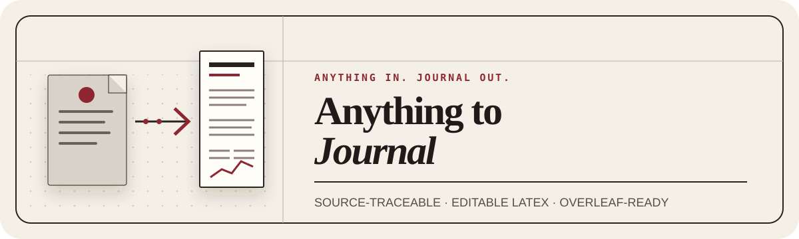

<p align="center">
  
</p>

<p align="center"><strong>Anything in. Journal out.</strong></p>

<p align="center">把一個研究資料夾裡的任何素材，整理成來源可追蹤的 Journal 稿件、可編輯 LaTeX 專案、逐頁檢查過的 PDF、本機 PDF／LaTeX Workspace，以及可直接上傳 Overleaf 的單一 ZIP。</p>

<p align="center"><a href="https://anything-to-journal-website.howardtuan.workers.dev/">官方網站</a> · <a href="README.md">English</a></p>

# Anything to Journal

Anything to Journal 是一套開源 Agent Skill。你只要把一篇稿件的所有素材放進全新資料夾、呼叫技能，並選擇「通用草稿」或「指定期刊／研討會」，agent 就會讀取完整素材集，對齊證據與引用，建立可稽核的 Journal 專案。

素材可以混合 PDF、Word、筆記、Markdown、LaTeX、試算表、資料集、圖、表、參考文獻匯出檔、補充資料、程式碼與官方出版社模板。每個檔案都有穩定來源 ID 與 SHA-256；有使用的內容會反向對應至稿件，未使用的素材也必須留下明確原因。

## 最後會拿到什麼

- 可編輯的 Journal／conference LaTeX 稿件；
- 已逐頁檢查的編譯 PDF；
- 素材清冊、逐檔審閱記錄、來源追蹤表與數值證據對照表；
- 保留來源的圖、表、公式、引用與支援檔案；
- 作者決策與品質閘門報告；
- 僅在本機運作、包含可捲動 PDF 預覽與 LaTeX 編輯器的 Manuscript Workspace；
- 可在 Overleaf 以 **New Project → Upload Project** 直接上傳的 `submission/overleaf-upload.zip`；
- 便於重現、審閱與交接的完整封裝。

技能不會虛構數據、文獻、作者、倫理核准、授權或投稿規則，也不會替作者進行外部投稿。

## 使用流程

```text
全新素材資料夾
      │
      ├─ 先選：通用草稿或指定投稿模板
      │
      ├─ 盤點並審閱每一個素材
      ├─ 對應證據、引用、圖、表與公式
      ├─ 撰寫 Journal 稿件
      ├─ 確認只能由作者決定的事項
      ├─ 編譯、逐頁檢查 PDF、執行稽核
      │
      ├─ journal-output/submission/overleaf-upload.zip
      └─ 本機 Manuscript Workspace：PDF 預覽 | LaTeX
```

格式選擇一定發生在讀取素材內容之前。指定期刊或研討會時，需有當前官方說明或官方模板；選通用草稿時使用內建的出版社中立交換格式，結果會清楚標示為草稿。

## 快速開始

### 1. 建立一個全新資料夾

```text
my-paper-materials/
├── study-notes.md
├── methods.docx
├── results.xlsx
├── analysis.csv
├── figure-01.png
├── references.bib
└── official-template.zip       # 選用
```

一個資料夾只放一篇稿件會用到的素材。不要混入其他研究專案，也不要放入前一次產生的 `journal-output/`。

### 2. 安裝技能

#### 建議方法：使用 npx 安裝

需要 Node.js 18 以上版本。用以下指令安裝 npm 上最新發布版本：

```bash
npx anything-to-journal@latest install
```

預設會安裝至 `$CODEX_HOME/skills/anything-to-journal`；若未設定 `CODEX_HOME`，則是 `~/.codex/skills/anything-to-journal`。若技能沒有自動出現，再重新啟動 Codex 即可。

未來要更新既有安裝時執行：

```bash
npx anything-to-journal@latest update
```

`install` 絕不覆寫既有目的地；`update` 會先確認目的地確實是 Anything-to-Journal，將新版放入暫存位置，再以原子操作取代舊版。

若要安裝至單一 repo 的 `.agents/skills`，可使用：

```bash
npx anything-to-journal@latest install --repo /absolute/path/to/repository
```

其他指定技能目錄可使用 `--destination /absolute/path/to/skills`。執行 `npx anything-to-journal@latest --help` 可查看全部選項。

#### 請 agent 安裝

複製本 repo 連結並傳給 agent：

```text
請幫我安裝這個 Agent Skill：https://github.com/howardtuan/Anything-to-Journal
```

#### Contributor 從 clone 安裝

Clone 本 repo 後執行：

```bash
python3 install.py
```

開發模式會以符號連結共用唯一技能來源：

```text
~/.agents/skills/anything-to-journal -> <本專案>/skills/anything-to-journal
```

若要獨立複製可用 `python3 install.py --mode copy`；若要安裝到單一 repo，可加 `--repo /path/to/repository`。安裝器不會覆寫既有目的地。

### 3. 交給 agent

開啟剛建立的素材資料夾，輸入 `/skill Anything-to-Journal`，並在後面加上你的問題或需求。例如：

```text
/skill Anything-to-Journal 把這個資料夾裡的所有素材做成 Journal 稿件。
```

在讀取素材前，agent 會先請你選：

- **通用草稿**：出版社中立、可繼續編輯的稿件；或
- **指定投稿格式**：依目前官方規則或你提供的官方模板，製作特定 journal／conference 版本。

你回答後，agent 才會逐檔讀取與分類、依證據起草、詢問作者專屬決策、編譯 PDF，並回傳完整輸出資料夾。

如果目前環境可以持續執行 localhost 程序，agent 接著會啟動 Manuscript Workspace 並回傳 `http://127.0.0.1:PORT` 網址。在 Codex Desktop 具有內建瀏覽器能力時，可把同一個頁面開在右側；完全相同的網址也能用 Chrome、Safari 或 Edge 開啟。

## 直接建立工作區

通常由 agent 代為執行。選好模式後，通用草稿可使用：

```bash
python3 skills/anything-to-journal/scripts/prepare_workspace.py \
  /absolute/path/my-paper-materials \
  --output /absolute/path/my-paper-materials/journal-output \
  --draft-only \
  --confirmed-by "REQUESTING USER" \
  --confirmation-note "User explicitly requested a generic journal draft."
```

指定投稿格式時，需同時記錄官方依據：

```bash
python3 skills/anything-to-journal/scripts/prepare_workspace.py \
  /absolute/path/my-paper-materials \
  --output /absolute/path/my-paper-materials/journal-output \
  --target-venue "VENUE NAME" \
  --venue-type journal \
  --official-guide-url "https://official.example/author-guide" \
  --guidance-file /absolute/path/my-paper-materials/official-template.zip \
  --confirmed-by "REQUESTING USER" \
  --confirmation-note "User chose the venue before source access."
```

研討會可用 `--venue-type conference`。輸入檔會以安全檔名複製，盤點過程不會執行素材內的程式、巨集或嵌入物件。

## 輸出結構

```text
journal-output/
├── source/
│   ├── materials/                    # 不可修改的素材副本
│   ├── source-manifest.json          # ID、路徑、大小、類型、雜湊
│   └── inventory.md                  # 人類可讀清冊
├── manuscript/
│   ├── manuscript.tex                # 主要可編輯原始檔
│   ├── references.bib
│   ├── traceability.csv
│   └── evidence-map.csv
├── reports/
│   ├── format-decision.json
│   ├── source-review.json
│   ├── author-decisions.json
│   ├── visual-inspection.json
│   ├── quality-report.md
│   └── workspace-invalidation.json  # audit 後又修改原始檔時產生
├── submission/
│   ├── overleaf-upload/              # 展開後的可編輯專案
│   ├── overleaf-upload.zip           # 只要上傳這一個檔案
│   ├── manuscript.pdf                # 或 DRAFT_NOT_FOR_SUBMISSION.pdf
│   └── submission-package.zip
└── project.json
```

來源帳本使用穩定的 `src-material-NNNN` ID。每個素材最終都會是 `verified` 並對應到實際輸出，或是 `not-used` 並附上具體原因。稿件中的數值陳述則會有與 `evidence-map.csv` 一致的相鄰證據標記。

## 在本機 Manuscript Workspace 編輯

論文完成後的循環如下：

```text
Anything-to-Journal
        ↓
產生 LaTeX + PDF
        ↓
啟動 Manuscript Workspace
        ↓
PDF 預覽 | LaTeX
        ↓
Codex 修改 或 手動修改
        ↓
儲存並重新編譯 PDF 預覽
        ↓
正式 build + 逐頁檢查 + audit
```

可直接用以下指令啟動：

```bash
python3 skills/anything-to-journal/scripts/workspace_editor.py \
  /absolute/path/journal-output
```

指令會印出像 `http://127.0.0.1:43127` 的網址，並持續執行直到你停止。預設 `--port 0` 會自動選擇可用連接埠；加上 `--open-browser` 則會請作業系統以預設瀏覽器開啟同一網址。

這套功能只有一份 Web UI，也只修改一組實際原始檔：

- **PDF 預覽**是預設分頁。嵌入式 PDF viewer 可直接捲動閱讀完整論文；每次預覽編譯成功會自動更新，編譯失敗則保留上一版成功的 PDF。
- **LaTeX** 直接編輯實際的 `journal-output/manuscript/manuscript.tex`。檔案選單也會找出其他同層 `.tex` 與 `.bib` 原始檔。輕量編輯器包含 LaTeX／BibTeX highlighting、行號、搜尋、Undo／Redo 與 Ctrl/Cmd+S。
- 儲存時會以原子操作寫入實際檔案、顯示 Saved／Unsaved／Compiling／Compile Failed，經短暫 debounce 後再編譯；也可隨時按 **Recompile**。
- 若 Codex 從聊天室修改原始檔，執行中的 Workspace 會偵測、在沒有未儲存內容時更新 Editor、重新編譯並刷新 PDF。如果瀏覽器內還有未儲存文字，畫面會顯示外部修改衝突，拒絕用舊版本覆寫磁碟內容。

Workspace 是預覽與編輯層，不會取代正式品質閘門。任何手動或 Codex 修改都會撤銷舊的 `submission_ready`、視覺檢查、作者最終核准雜湊、已升級的投稿 PDF 與完整封裝狀態。完成最後修改後，仍要重新執行既有正式流程：

```bash
python3 skills/anything-to-journal/scripts/build.py /absolute/path/journal-output
python3 skills/anything-to-journal/scripts/audit.py /absolute/path/journal-output --require-pdf
```

伺服器只綁定 `127.0.0.1`，會拒絕 path traversal、原始檔 symlink、跨來源寫入及讀取專案外檔案；不使用外部 CDN、不上傳論文，預覽編譯也不啟用 LaTeX shell escape。Codex Desktop 與一般瀏覽器只是顯示同一個 localhost 頁面，不依賴另一套 Desktop UI 或不存在的私有 Codex API。CLI 或 headless 環境可略過這個額外 UI，原本的 build、audit、封裝與 Overleaf 流程仍完整可用。

## 在 Overleaf 編輯

請只上傳：

```text
journal-output/submission/overleaf-upload.zip
```

在 Overleaf 中：

1. 選 **New Project → Upload Project**；
2. 選取 `overleaf-upload.zip`；
3. 確認 `main.tex` 是 Main document；
4. 依 `README_OVERLEAF.md` 選擇 compiler；
5. 按 **Recompile**。

ZIP 沒有額外的最外層資料夾，`main.tex` 就在根目錄。裡面包含書目、必要的 `.tex`／`.cls`／`.sty`／`.bst` 與有引用的素材；不會把私人證據、報告、編譯垃圾或最終 PDF 混入。你可以直接編輯 `main.tex`、`references.bib`、其他 `.tex` 與圖檔。

目前官方流程與限制請以 Overleaf 的 [Upload a project](https://docs.overleaf.com/managing-projects-and-files/uploading-a-project) 文件為準。

## 編譯與稽核

完成稿件與作者決策後執行：

```bash
python3 skills/anything-to-journal/scripts/build.py /absolute/path/journal-output
python3 skills/anything-to-journal/scripts/audit.py /absolute/path/journal-output --require-pdf
```

稽核會檢查格式確認、完整逐檔審閱、來源雜湊、引用與證據對應、圖表公式、作者決策、LaTeX log、PDF 雜湊、頁數、視覺檢查紀錄與封裝內容。只要有硬性失敗，就只會輸出 `DRAFT_NOT_FOR_SUBMISSION.pdf` 與 blocker ID，不會宣稱已可投稿。

若素材含 `.docx`，還可使用高保真轉接器盤點 OOXML、修訂、欄位、文獻、媒體、原生物件、表格、公式、註解與關聯：

```bash
python3 skills/anything-to-journal/scripts/preflight.py source-document.docx --strict
```

## 固定品質規則

除非已確認的官方模板有更嚴格且相容的要求，工作流會維持：

- 圖說在圖下、表說在表上；
- 圖表放在第一次實質引用附近；
- 段落首行縮排 2em、段距 0pt；
- 含參考文獻在內的完整稿件最多 19 頁；
- 不留下未解 placeholder、引用、文獻或無來源的數值敘述；
- 最終編譯後逐頁檢查；
- 由人類作者負責最後核准與投稿。

## 需求

- npx 安裝器需要 Node.js 18 以上版本；
- Python 3.10 以上；
- TeX 引擎：優先 Tectonic，也支援 XeLaTeX 或 LuaLaTeX；
- 選用本機 Manuscript Workspace 時需要目前版本的瀏覽器；
- 選用 Pandoc 進行豐富的 DOCX 語意轉換；
- 選用 LibreOffice／Word、Poppler 與影像工具進行高保真渲染與檢查。

可用以下指令檢查環境：

```bash
python3 skills/anything-to-journal/scripts/doctor.py
```

## 開發

執行 npx 安裝器測試、合成技能測試與技能驗證器：

```bash
npm test
python3 -m unittest discover -s tests -v
python3 /path/to/skill-creator/scripts/quick_validate.py skills/anything-to-journal
```

測試素材只能使用合成 fixture。不得提交使用者未公開的來源、個資、受版權保護的出版社模板或機密結果。

## 授權與引用

本專案的原始程式與文件採 [MIT License](LICENSE)。使用者素材、生成稿件、出版社模板、字型與第三方工具保留各自授權；詳見 [THIRD_PARTY_NOTICES.md](THIRD_PARTY_NOTICES.md)。

軟體引用資訊見 [CITATION.cff](CITATION.cff)。
